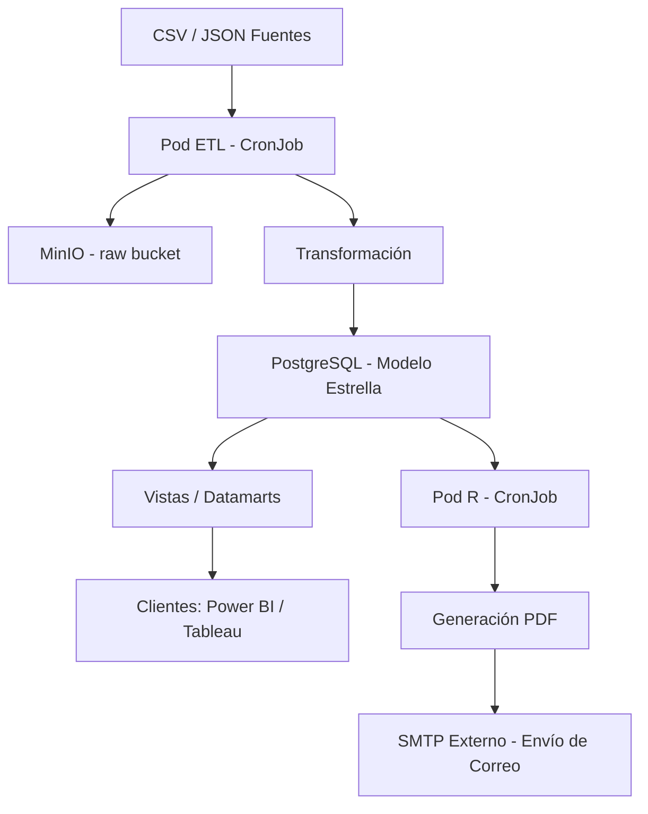

# Proyecto Data Lakehouse en Gentoo (Actualizado)

Este README describe los **prerrequisitos del sistema base (Gentoo)** y las **instrucciones generales** para desplegar el proyecto utilizando Kubernetes (k3s), MinIO, PostgreSQL, ETL en Go, y reportes automáticos en R. Incluye ahora:

* Uso de R como pod
* Envío de correo por SMTP **sin pod dedicado**
* Diagrama en Mermaid

---

## 1. Prerrequisitos del Sistema Base (Gentoo)

El nodo principal será tu PC con Gentoo. Debe tener:

### **Sistema Operativo y Kernel**

* Gentoo GNU/Linux actualizado.
* Kernel con:

  * Namespaces
  * Cgroups v1/v2
  * OverlayFS
  * Soporte de red para contenedores

### **Herramientas y Servicios Base**

* containerd o Docker (para k3s basta containerd).
* k3s en modo single-node.
* Git para versionar el proyecto (solo metadatos, infraestructura y código).
* Cron (opcional si algunas tareas se hacen fuera del cluster).

### **Red y Acceso LAN**

* LAN con acceso a Internet.
* Puerto 5432 expuesto a la LAN para clientes Power BI/Tableau.

### **Almacenamiento**

* Directorio o disco dedicado para PersistentVolumes.
* Formato ext4/XFS recomendado.

---

## 2. Componentes del Proyecto en Kubernetes

El cluster k3s en Gentoo incluye:

### **1. MinIO (Data Lake de objetos)**

* Deployment o StatefulSet.
* Buckets: `raw/` y `processed/`.
* Respaldado con un PVC en el host.

### **2. ETL Loader (Go) — CronJob**

* Corre periódicamente.
* Pasos:

  1. Obtiene CSV/JSON.
  2. Sube archivos crudos a MinIO.
  3. Estandariza y normaliza.
  4. Carga datos limpios a PostgreSQL.

### **3. PostgreSQL (Data Warehouse)**

* StatefulSet.
* Modelo estrella implementado.
* Vistas especializadas (datamarts).
* Los clientes **se conectan directamente** al puerto 5432.

### **4. R Report Pod — CronJob**

* Imagen Docker basada en R.
* Ejecuta script semanal:

  * Genera reporte en PDF.
  * Envía correo mediante SMTP **externo** (sin pod adicional).

### **5. Git (externo al cluster)**

* Guarda:

  * Código del ETL.
  * Scripts SQL.
  * Manifests YAML.
  * Scripts R.
  * Diagramas y documentación.
* No guarda datos crudos.

---

## 3. Instrucciones Generales

### **1. Preparar entorno k3s**

* Instalar k3s.
* Crear namespaces.
* Crear PV/PVC para MinIO y PostgreSQL.

### **2. Desplegar MinIO**

* Crear StatefulSet.
* Definir buckets.

### **3. Desplegar PostgreSQL**

* StatefulSet + PVC.
* Exponer servicio a la LAN.
* Crear usuario de solo lectura para clientes.

### **4. Desplegar ETL (Go) como CronJob**

* Contenedor con binario del ETL.
* CronJob programado según frecuencia necesaria.

### **5. Deploy del Pod de R para reportes**

* Imagen basada en R (rocker/tidyverse o similar).
* CronJob semanal.
* Configuración SMTP externo.

### **6. Conexión de Clientes**

* Power BI/Tableau se conectan a la IP LAN del nodo Gentoo.
* Solo lectura sobre vistas/datamarts.

### **7. Automatización y Limpieza**

* MinIO con políticas de ciclo de vida.
* CronJob del ETL refresca datos.
* Git versiona infraestructura y código.

---

## 4. Diagrama en Mermaid



---

## 5. Resumen del Flujo de Datos

```
Fuentes CSV/JSON → ETL Pod → MinIO (raw) → Limpieza → PostgreSQL (DW) → Vistas → Cliente
Reportes Semanales → Pod R → SMTP Externo
```

---

## 6. Consideraciones Finales

* No se usa API para los clientes; la conexión es directa a PostgreSQL.
* MinIO es almacenamiento de objetos, no filesystem.
* Git no guarda datos crudos; solo metadatos y código.
* El pod de R maneja reportes y envíos SMTP sin pod SMTP dedicado.
* Kubernetes administra contenedores; Gentoo sigue siendo el SO real.

---


